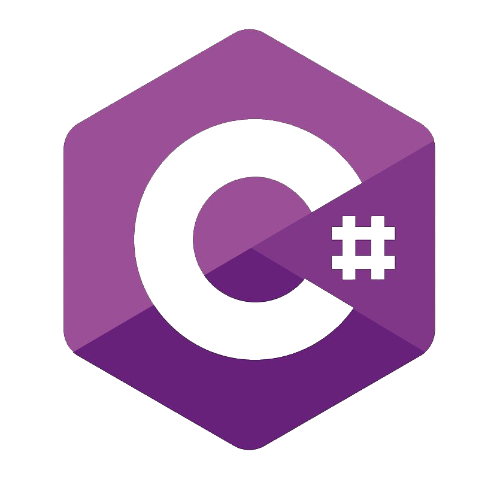
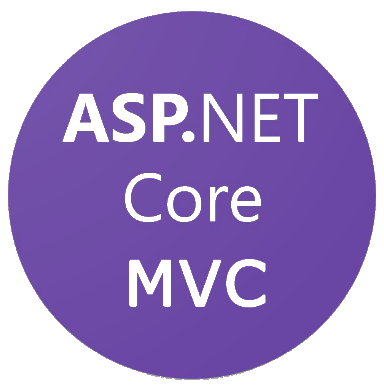
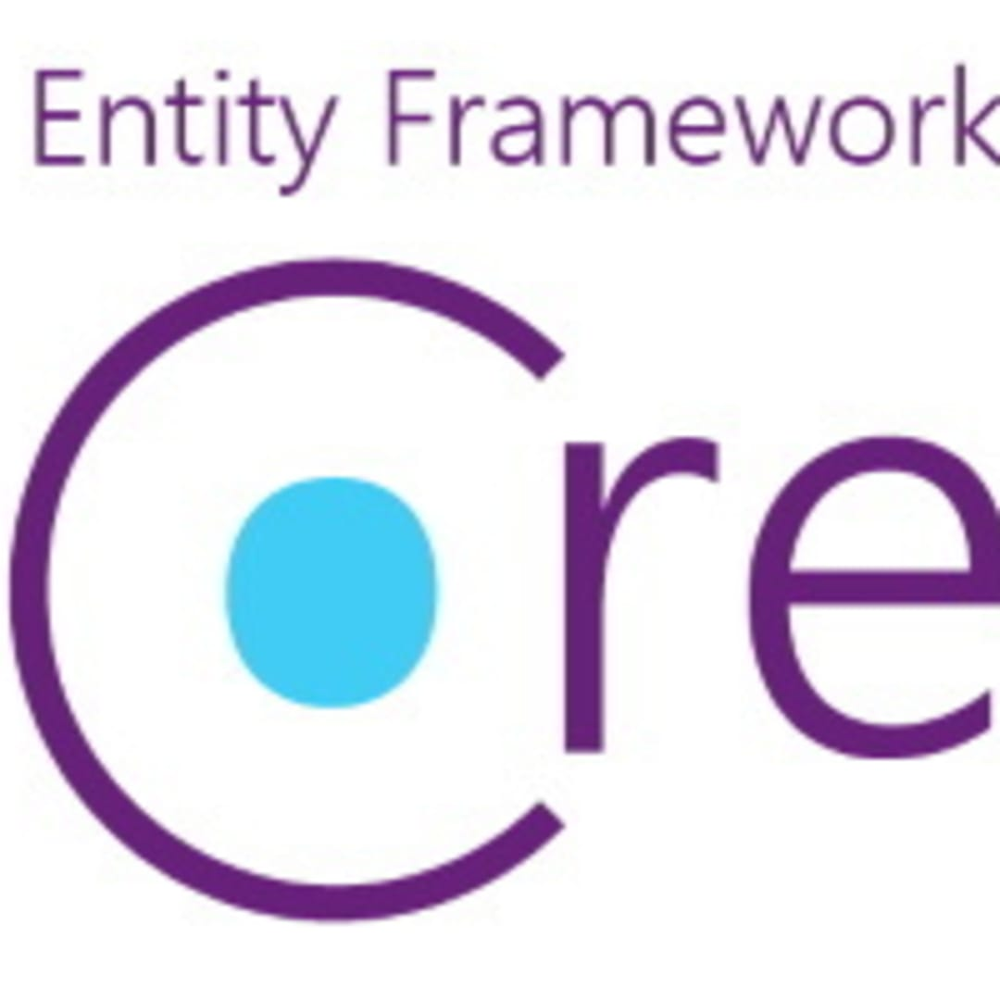

### Hi there 

## My name is Ivan Gyoshev

### 📫 How to reach me: 

### 🔭 Check out my ASP.Net MVC Forum System App [Astronomyfi](https://github.com/Ivan-Gyoshev/Astronomyfi) 

### My Tech Stack

  

<!--
**Ivan-Gyoshev/Ivan-Gyoshev** is a ✨ _special_ ✨ repository because its `README.md` (this file) appears on your GitHub profile.

Here are some ideas to get you started:

- 🔭 I’m currently working on ...
- 🌱 I’m currently learning ...
- 👯 I’m looking to collaborate on ...
- 🤔 I’m looking for help with ...
- 💬 Ask me about ...
- 📫 How to reach me: ...
- 😄 Pronouns: ...
- ⚡ Fun fact: ...
-->
